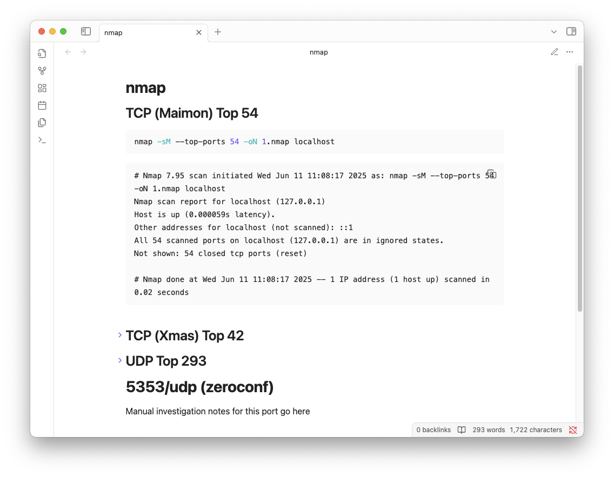

# n2m

vibe coded go tool that makes markdown notes from nmap output. only supports nmap -oN format


## install
```
make install
```

## usage
```
n2m [-o output.md] [-header] <nmap-file1> [nmap-file2] ...

Usage:
  -header
        prepend a top-level header with the host's IP address (default: false)
  -o string
        output markdown file (optional)

Example:
  n2m all-tcp.nmap
  n2m -o 10.10.11.174.md all-tcp.nmap top-1000-tcp-script-scan.nmap udp-1000.nmap
  n2m -header -o results.md *.nmap
```

### intended use case

can be used as is but originally intended for use with [notesplz](https://github.com/raffaele-99/notesplz) and [portsplz](https://github.com/raffaele-99/portsplz):
```
$ sudo nmap -Pn -T4 -v -p- <target> -oN tcp-first.nmap
$ sudo nmap -Pn -v -sCV -p $(portsplz tcp-first) <target> -oN tcp-second.nmap
$ sudo nmap -Pn -sU --top-ports 1000 <target> -oN udp-first.nmap
$ n2m *.nmap >> <path_to_notesplz_nmap_file>
```

### cool stuff

scan titles are generated by reading the flags that were passed to nmap
```bash
$ sudo nmap -sM --top-ports 54 -oN 1.nmap localhost
$ sudo nmap -sX --top-ports 42 -oN 2.nmap localhost
$ sudo nmap -sU --top-ports 293 -T5 -oN 3.nmap localhost
$ n2m *.nmap > nmap.md
```


